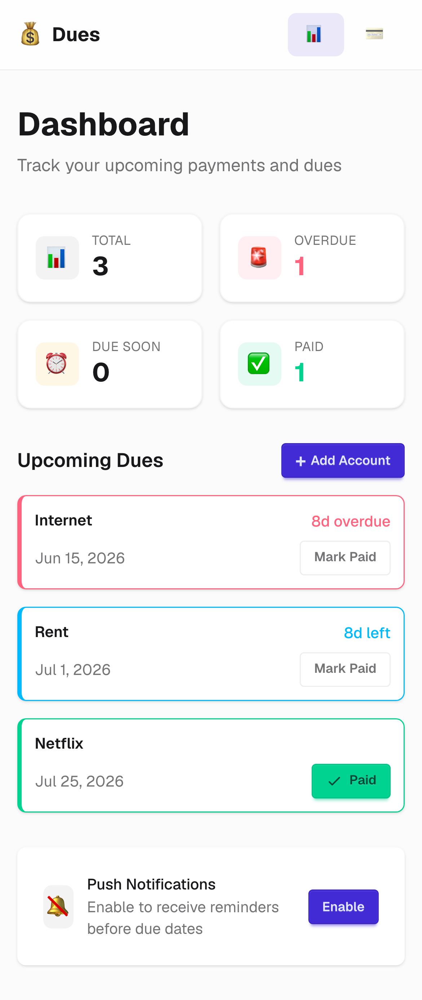

# Dues

A payment reminder app that tracks recurring and one-time dues with push notifications.

<p align="center">
  
</p>

## Tech Stack

- **Framework**: Next.js 16 (App Router)
- **Database**: Turso (libSQL) with Drizzle ORM
- **Styling**: Tailwind CSS + DaisyUI
- **Animations**: Framer Motion
- **Testing**: Vitest (unit) + Playwright (e2e)

## Getting Started

```bash
pnpm install
pnpm dev
```

Open [http://localhost:3000](http://localhost:3000).

## Scripts

| Command            | Description                 |
| ------------------ | --------------------------- |
| `pnpm dev`         | Start dev server            |
| `pnpm build`       | Production build            |
| `pnpm start`       | Start production server     |
| `pnpm lint`        | Run ESLint                  |
| `pnpm format`      | Format with Prettier        |
| `pnpm db:generate` | Generate Drizzle migrations |
| `pnpm test`        | Run unit tests              |
| `pnpm test:e2e`    | Run Playwright tests        |

## Project Structure

```
src/
├── app/            # Next.js pages and layouts
├── components/     # React components
├── actions/        # Server actions
├── lib/            # Utilities and DB client
└── workers/        # Service worker
```
